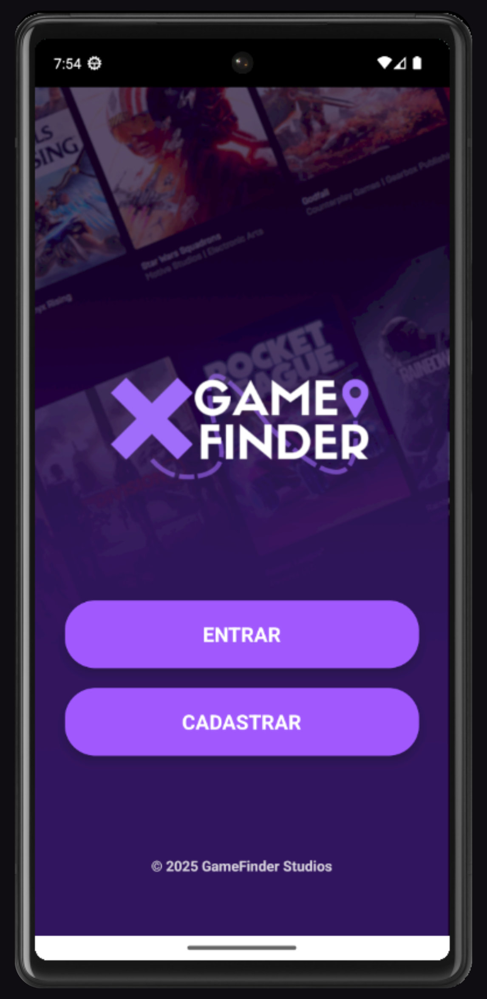
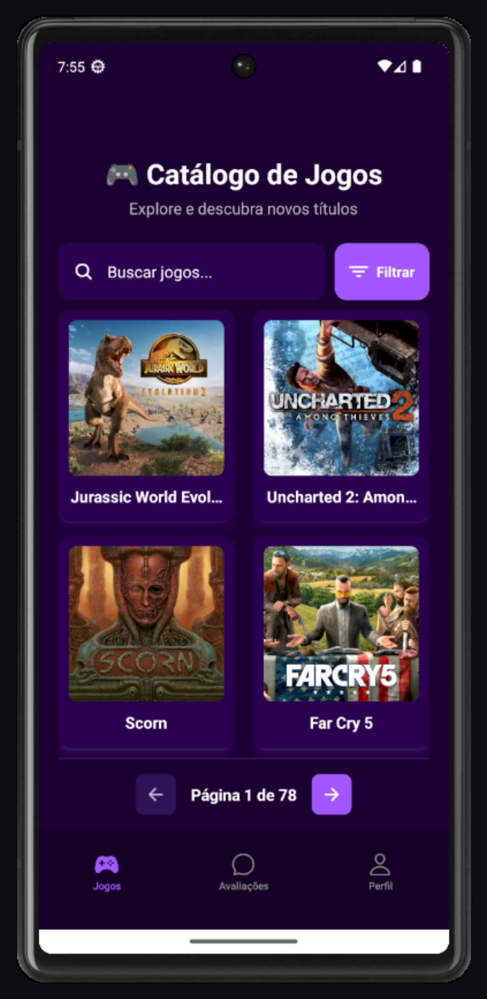
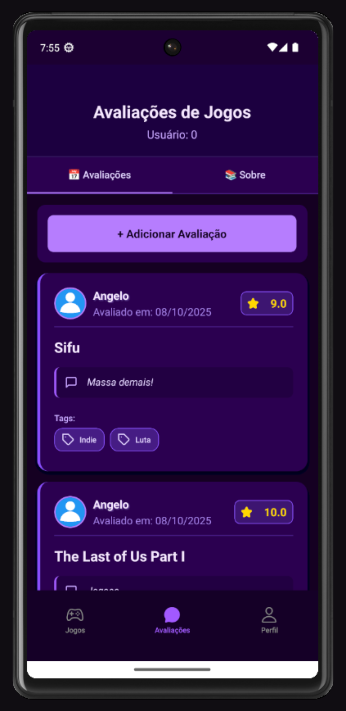
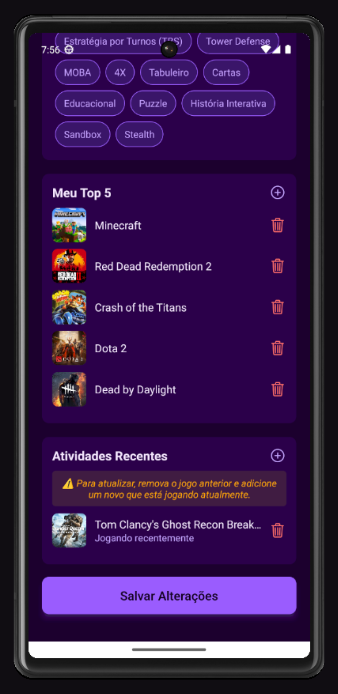

# 🎮 GameFinder

Aplicativo mobile desenvolvido como **projeto acadêmico no SENAI**, com o objetivo de ajudar usuários a encontrarem jogos de acordo com suas preferências, estilo e humor.

O projeto foi pensado para ser simples, intuitivo e funcional, focando em experiência do usuário e organização do código.

---

## Funcionalidades

- Busca de jogos por preferências
- Interface mobile simples e intuitiva
- Integração com back-end e banco de dados
- Estrutura preparada para expansão de filtros e categorias

---

## Tecnologias Utilizadas

- **React Native** — desenvolvimento mobile
- **Node.js** — back-end
- **MySQL** — banco de dados relacional
- **APIs REST**
- **Git & GitHub** — versionamento

---

## Telas do Aplicativo

  
  
  
  
  

---

## Documentação do Projeto

O GameFinder possui documentações formais que detalham tanto os requisitos quanto os testes realizados durante o desenvolvimento:

- 📘 **Especificação de Requisitos de Software (ERS)**  
  Documento que descreve os requisitos funcionais, não funcionais e regras de negócio do sistema.  
  👉 [Acessar ERS](./docs/ers-gamefinder.pdf)

- 🧪 **Documento de Testes de Software**  
  Apresenta os cenários, casos de teste e validações aplicadas ao projeto.  
  👉 [Acessar documento de testes](./docs/testes-gamefinder.pdf)

---

## Contexto Acadêmico

Projeto desenvolvido em grupo como **Trabalho de Conclusão de Curso (TCC)** no curso Técnico em Desenvolvimento de Sistemas pelo **SENAI**, envolvendo:

- divisão de tarefas
- versionamento com Git
- desenvolvimento front-end e back-end
- modelagem de banco de dados

---

## Status do Projeto

✔️ Concluído como projeto acadêmico  
🔧 Aberto a melhorias e refatorações futuras

---

