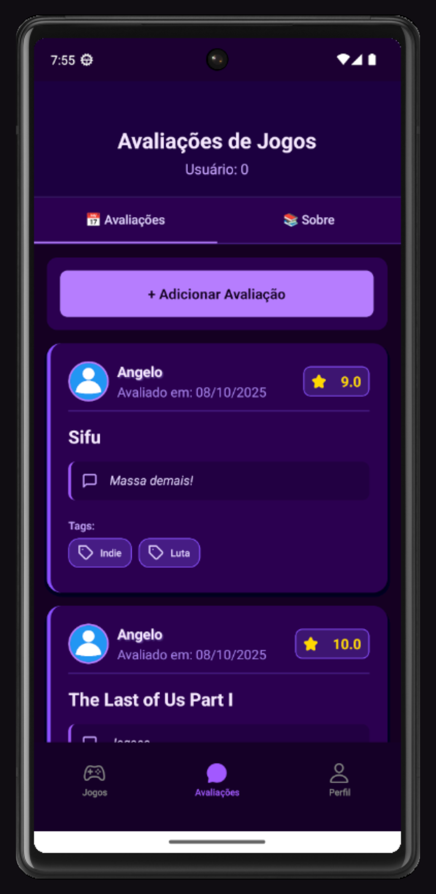
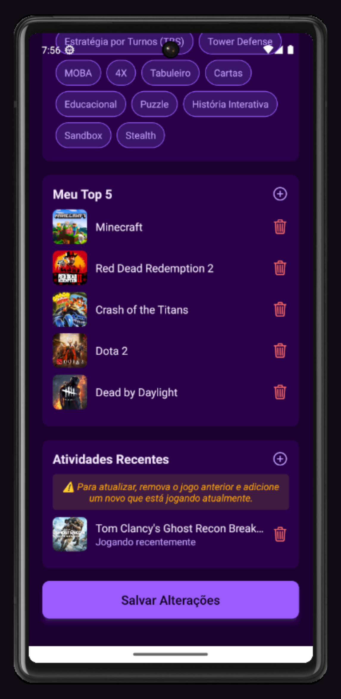

# 🎮 GameFinder

Aplicativo mobile desenvolvido como **projeto acadêmico no SENAI**, com o objetivo de ajudar usuários a encontrarem jogos de acordo com suas preferências, estilo e humor.

O projeto foi pensado para ser simples, intuitivo e funcional, focando em experiência do usuário e organização do código.

---

## Funcionalidades

- Cadastro e login de usuários
- Lista de jogos com busca e filtros por plataforma e data
- Avaliações de jogos com nota, comentário e tags (criar, editar e excluir)
- Perfil do usuário com edição de dados e escolha de avatar
- Integração com back-end em Node.js e banco de dados MySQL

---

## Tecnologias Utilizadas


- **React Native + Expo**: aplicativo mobile, com React Navigation
- **Node.js + Express**: API REST do back-end
- **MySQL**: banco de dados relacional
- **Git & GitHub**: versionamento

---

## Telas do Aplicativo

<p align="center">
  
  
  
  
  
</p>

---

## Como Executar

### Pré-requisitos
- [Node.js](https://nodejs.org/)
- [MySQL](https://www.mysql.com/) (ou XAMPP)
- App **Expo Go** no celular

### 1. Banco de dados
Crie um banco chamado `gamefinder` e importe o backup mais recente:
```bash
mysql -u root -p gamefinder < "Bancos/Mais_Recente/gamefinder_backup_atualizado_17_10.sql"
```

### 2. Back-end
```bash
cd backend
npm install
npm start
```
A API sobe em `http://localhost:3000/api`. Os dados de conexão com o banco ficam em `backend/db.js`.

### 3. Aplicativo
Troque o `API_URL` nas telas em `frontend/GameFinder/src/screens/` pelo IP do computador onde o back-end está rodando. Depois:
```bash
cd frontend/GameFinder
npm install
npm start
```
Escaneie o QR code com o Expo Go.

---

## Estrutura

```
├── backend/            # API REST (Express + MySQL)
│   ├── server.js
│   ├── routes.js       # Rotas de usuários, jogos e avaliações
│   └── db.js           # Conexão com o banco
├── frontend/GameFinder/
│   └── src/
│       ├── navigation/ # Navegação (stack e abas)
│       └── screens/    # Telas do app
├── Bancos/             # Backups do banco de dados
└── docs/               # ERS e documento de testes
```

### Principais rotas da API

| Método | Rota | Descrição |
|---|---|---|
| POST | `/api/register` | Cadastro de usuário |
| POST | `/api/login` | Login |
| GET / PUT | `/api/usuario/:id` | Ver e editar perfil |
| GET | `/api/jogos` | Lista de jogos |
| POST | `/api/salvar-avaliacao` | Criar avaliação |
| GET | `/api/avaliacoes` | Listar avaliações |
| PUT / DELETE | `/api/avaliacoes/:id` | Editar ou excluir avaliação |

---

## Documentação do Projeto

O GameFinder possui documentações formais que detalham tanto os requisitos quanto os testes realizados durante o desenvolvimento:

- 📘 **Especificação de Requisitos de Software (ERS)**  
  Documento que descreve os requisitos funcionais, não funcionais e regras de negócio do sistema.  
  👉 [Acessar ERS](./docs/ers-gamefinder.pdf)

- 🧪 **Documento de Testes de Software**  
  Apresenta os cenários, casos de teste e validações aplicadas ao projeto.  
  👉 [Acessar documento de testes](./docs/testes-gamefinder.pdf)

---


## Contexto Acadêmico

Projeto desenvolvido em grupo como **Trabalho de Conclusão de Curso (TCC)** no curso Técnico em Desenvolvimento de Sistemas pelo **SENAI**, envolvendo:

- divisão de tarefas
- versionamento com Git
- desenvolvimento front-end e back-end
- modelagem de banco de dados

---

## Status do Projeto

✔️ Concluído como projeto acadêmico  
🔧 Aberto a melhorias e refatorações futuras

---

Desenvolvido em grupo no SENAI · Repositório mantido por [Angelo Gabriel](https://github.com/aangelkjpn)
